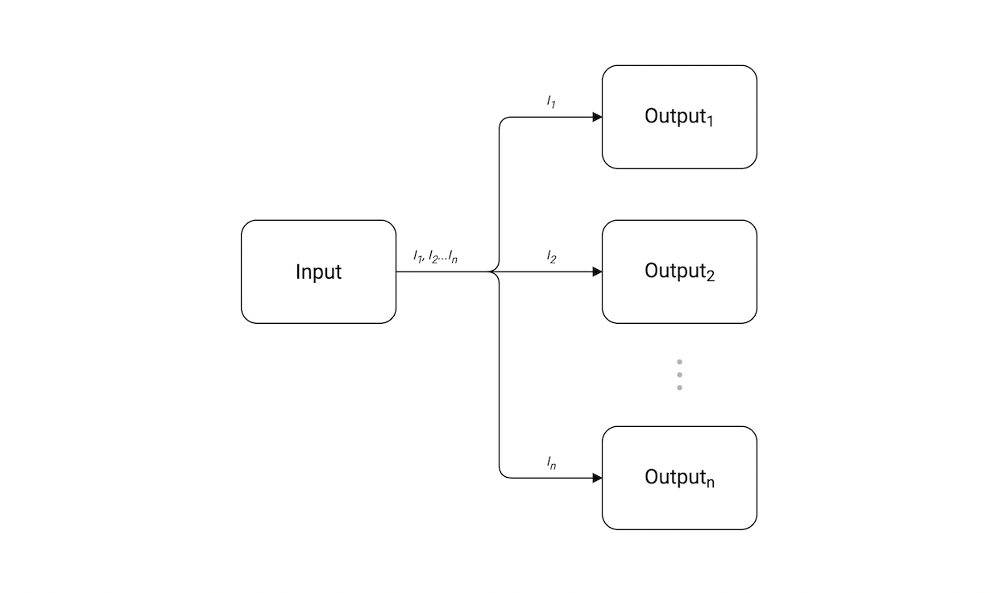
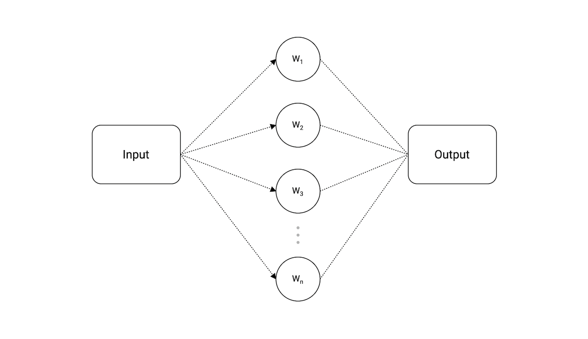

# Generator:
A function which returns a channel(Generator) which will provide the generated messages.
```go
func startGenerator() chan string{
	c := make(chan string) // the channel on which generated message will be published.
	go func(){
		for {
			message := "Really a New Message!"
			c <- message
			time.Sleep(time.Duration(rand.Intn(1e3)) * time.Millisecond)
        }
    }()
	
	return c
}
```

# Fan in
Bind Multiple Input channels to a single output channel.
```go
func FanIn(input1, input2 <-chan string) <-chan string {
	outputChan := make(chan string)
	go func() {
		for i := 0; i < 20; i++ {
			select {
			case msg := <-input1:
				outputChan <- msg
			case msg := <-input2:
				outputChan <- msg
			}
		}

	}()
	return outputChan
}
```
# Fan-Out
A Single input channel to multiple output channels.

```go
func fanOut(in <-chan int) <-chan int {
	out := make(chan int)

	go func() {
		defer close(out)

		for{
			out <- <-in
		}
	}()

	return out
}

func main() {
    
    in := make chan(int)
    
	// Bind multiple output channels to that single 'in' channel which produces the data.
    out1 := fanOut(in)
    out2 := fanOut(in)
    out3 := fanOut(in)
    out4 := fanOut(in)
	
	
}
```


# Timeout a Channel if it takes time
```go
select {
case msg := <-c:
    fmt.Println(msg)
case <-time.After(3 * time.Second):
    fmt.Println("Waited too long. Bye!")
}
```

Wait for certain limit and then getout.

# Worker-Distriution
The exist a pool of workers which recieves on reciever channel, process the recieved data and sends the output to output channel.

For example Code : [Ref](./workerDristribution.go)


